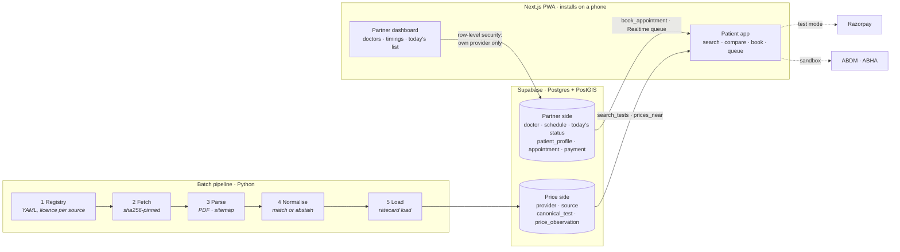

# Bengaluru Rate Card

**See what a medical test costs at hospitals near you, from each hospital's own
published rate card. At partner hospitals, you can also register once, book,
pay and track your place in the queue from your phone.**

Two things go wrong today when someone needs care in a private hospital:

1. **Prices are invisible.** A doctor writes *"CBC and lipid profile"* on a
   slip. The same lipid profile can cost ₹2,110 at one place and ₹449 a few
   kilometres away, and there is nowhere to look that up.
2. **Every visit starts at a counter.** You fill the same registration form at
   every hospital, on a different website or in a different queue, and you
   wait without knowing whether the doctor has even arrived.

This project fixes both, and is careful never to claim more than it knows.

## What it does

The app has two halves, and they work differently on purpose.

| | Price comparison | Booking, live status, queue |
|---|---|---|
| **Who it covers** | Every provider with a public rate card we are allowed to show | **Partner** providers only, those who sign up |
| **Where the data comes from** | Extracted from the provider's published documents | Entered by the provider's own staff |
| **What you get** | One test, nearby providers, cheapest first, with the source document and its date on every price | Doctor timings, "Dr X is in OPD, 4 ahead of you, about 25 min", one-tap booking, one profile reused everywhere |
| **Everyone else sees** | — | Phone number and directions. Never a Book button that can't deliver. |

A price comparison is built *against* the supply side, since an expensive lab
does not want to be listed next to a cheap one. So it runs on extraction, not
sign-ups. Booking is built *with* the supply side, because a clinic wants its
slots filled. That asymmetry decides the whole architecture. See
[docs/product.md](docs/product.md).

It is **not an emergency tool**. The app's only emergency path is a button that
dials 108 / 112 and opens a map. It never asks anyone to register first.

## The hard part: is "CBC" the same test as "COMPLETE BLOOD COUNT (CBC)"?

Extraction is easy, because the source PDFs carry text layers. **Naming is
hard.** The same test appears as `COMPLETE BLOOD COUNT (CBC)`, `CBC` and
`Complete Blood Count`. Meanwhile `RED BLOOD CELL COUNT` is a *different* test
at a different price. Until names resolve to one canonical test, no two prices
can be compared.

- **A hand-curated taxonomy:** 210 canonical tests, 1,046 surface forms, and
  LOINC codes checked against the official release (14 of 145 were wrong and
  are now fixed). Every field exists to block a specific confusion: `is_panel`
  (CBC vs RBC count), `specimen` (serum albumin vs urine microalbumin),
  `contrast` (CT plain vs contrast), `distinct_from` (troponin I vs T).
- **A matcher that abstains.** It has four layers: exact alias, fuzzy
  candidates, a structural veto, and an optional embedding rerank. When it
  isn't sure, it says so, and the row is held back rather than shown wrong.
- **A learned acceptor.** A logistic regression over 15 pair features replaces
  the hand-set thresholds.

Measured on a stratified, labelled sample (train split, out-of-fold):

| | precision | recall | wrong matches |
|---|---|---|---|
| exact alias hits | **100%** (n=42) | — | 0 |
| fuzzy matcher, fixed thresholds | 11.5% [7–19] | 57.9% | 85 |
| **learned acceptor** | **87.5% [64–97]** | 73.7% | 2 |

Hard-negative accuracy is 91.4% [84–96], n=93. These numbers are
**provisional**, for three reasons:
- the labels were produced by a language model, not a human annotator
- there are only 19 positive pairs
- the 155-row holdout has not been scored yet

That is why only exact alias hits are public today. The full method, including
every bug a review found, is in [docs/matching.md](docs/matching.md) and
[docs/price-engine.md](docs/price-engine.md).

## Architecture



- **Everything upstream of the database is a replayable batch job.** Raw
  documents are immutable and hash-pinned, so "what did this rate card say in
  March?" always has an answer.
- **No application server.** The queries the app needs are SQL functions.
  `search_tests` is autocomplete over exact aliases: it suggests, the user
  picks, nothing is guessed. `prices_near` is a PostGIS radius query, cheapest
  first, with the source on every row. `search_specialties` and `doctors_near`
  do the same for "a cardiologist near me": partner doctors of one specialty,
  cheapest consultation first, with today's hours and status. Booking, the
  queue and access rules live in the same database.
- **The fuzzy matcher never runs at query time.** It runs once, in the batch
  job, where its output can be reviewed.

Full detail, the data model and every choice explained:
[docs/architecture.md](docs/architecture.md).

### Rules the system enforces, not just documents

| Rule | Enforced by |
|---|---|
| A price cannot exist without a source and a date | schema: `source_id` and `as_of` are `not null` |
| Only prices the matcher was sure of are shown | a row-level security policy on `price_observation`, plus a filter in `prices_near` |
| A source we may not display never reaches the database | registry `display_ok`, checked again by the loader. Guwahati prices were once published as Bengaluru ones, and this is why. |
| A provider that hasn't signed up can never be booked | `book_appointment`, and again by a trigger on `appointment` |
| Demo data can never pass as real | a trigger ties `demo_seed` sources to demo providers, in both directions |
| No double booking | unique index on (doctor, slot, seat), plus a per-doctor lock |
| A doctor's specialty comes from the list, never free text | foreign key `doctor.specialty_id` |
| A patient sees only their own records; a hospital sees only patients who booked there | row-level security |

## Status

| Phase | | State |
|---|---|---|
| 00–01 | Seed corpus, canonical taxonomy | done: 210 tests, LOINC verified |
| 02 | Matcher | built; fixed thresholds are deliberately untuned |
| 03 | Label and evaluate | train split labelled (345, model-labelled); **holdout 0/155**; learned acceptor trained, opt-in |
| 04 | Pipeline, stages 1–3 | done: `ratecard ingest --fetch` builds ~13,000 rows from 5 sources, **1 of which may be displayed** |
| 05 | Database and loader | schema and `ratecard load` written; migrations tested against a local Postgres + PostGIS; not yet applied to a live Supabase |
| 06 | Patient PWA: price search | next |
| 07 | Partner dashboard, fictional demo hospitals | planned |
| 08 | Register once, book, live queue | planned |
| 09 | Payments, Razorpay test mode | planned |
| 10 | ABHA through the ABDM sandbox | planned |

Today a dry run of the loader publishes **111 real prices across 106 tests,
all from one hospital** (Mazumdar Shaw Medical Center, Narayana Health City).
One provider is not a comparison. Adding displayable sources is a YAML entry
per source, and it is the biggest gap.

This is a portfolio build. Its partner hospitals are **fictional, seeded and
badged "Demo"** everywhere they appear, and are never named after a real
hospital. It stores no real patient data.

## Quickstart

```bash
git clone https://github.com/Naman9245/diagnostic-price-transparency.git
cd diagnostic-price-transparency
python -m venv .venv
# Windows: .venv\Scripts\activate     macOS/Linux: source .venv/bin/activate
pip install -e ".[dev,normalise,pipeline,serve]"
```

```bash
ratecard validate                          # taxonomy invariants
ratecard lookup "haemogram" "sugar F"      # exact resolution through the alias index
ratecard specialty "kidney doctor"         # a specialty, or the ones a word points at
ratecard check cbc rbc_count               # why two tests may never be matched
ratecard ingest --fetch                    # download the registered sources, build the corpus
ratecard match data/corpus/phase00.csv     # run the matcher over it
ratecard load --dry-run                    # what the database would get, and what would be public
python -m pytest tests/ -q                 # 323 tests, plus 10 that need a database
```

`validate`, `stats`, `lookup`, `specialty`, `check` and `hard-negatives` run on the standard
library plus PyYAML alone, so the taxonomy can be checked on a bare machine.
Heavier stages are optional extras in `pyproject.toml`, and a test enforces
that they stay optional.

To load a database, apply `supabase/migrations/` to a Supabase project, then:

```bash
DATABASE_URL="postgresql://..." ratecard load
```

## Repository layout

```
src/ratecard/
  registry/ fetch/ parse/   stages 1–3: which documents, fetched immutably, parsed with provenance
  taxonomy/                 210 canonical tests in YAML, validated hard
  specialties/              41 medical specialties: what patients search by, doctors are filed under
  normalise/                stage 4: the matcher and its veto rules
  learn/ evaluate/          learned acceptor; stratified sampling, labelling, metrics
  load/                     stage 5: records for Postgres, and which of them may be public
supabase/migrations/        schema, access rules, booking and queue functions
data/eval/                  committed labels (irreplaceable)
data/models/                the trained acceptor, plain JSON
docs/                       product, architecture, matching, price engine
tests/                      including a regression test for every bug found in review
```

## Documentation

| | |
|---|---|
| [docs/product.md](docs/product.md) | who it is for, the two halves, and what it is not |
| [docs/architecture.md](docs/architecture.md) | the pipeline, the database, the partner side, and why each choice |
| [docs/matching.md](docs/matching.md) | how the matching works: four layers, the veto, the evaluation |
| [docs/price-engine.md](docs/price-engine.md) | the engineering record: sources, numbers, rerank, review findings |
| [docs/curating-the-taxonomy.md](docs/curating-the-taxonomy.md) | how to add a test, a specialty or an alias |
| [docs/labelling-worked-examples.md](docs/labelling-worked-examples.md) | fifteen real rows labelled end to end |
