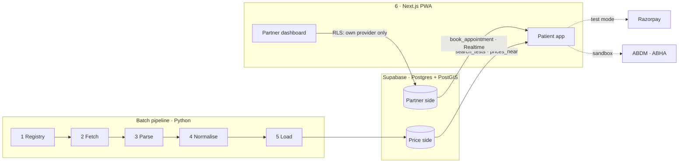
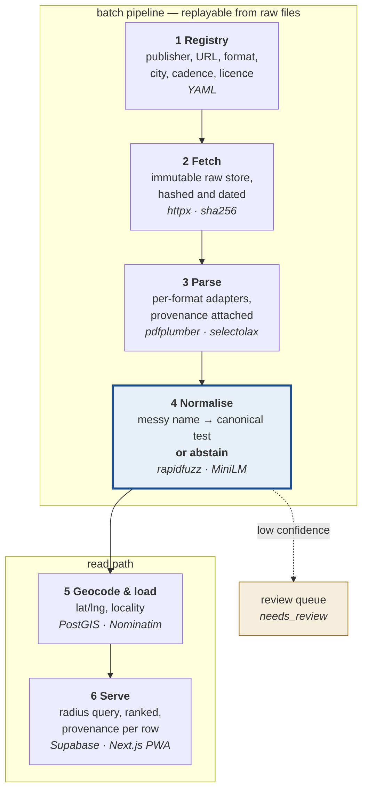
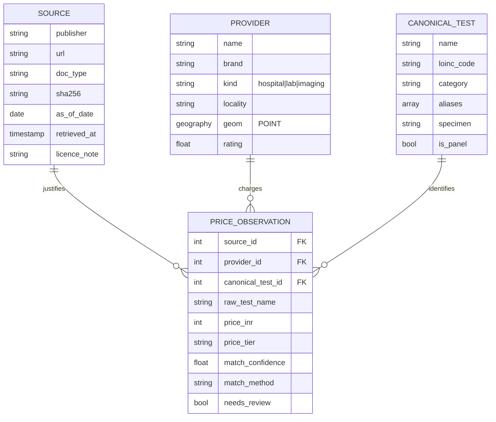

# Architecture

## The whole system



Two halves share one database and one app, and are fed in opposite ways:

- **The price side is extracted.** Nobody uploads a rate card, and an
  expensive lab has every reason not to. So stages 1–5 are a batch pipeline
  replayable from immutable raw files, and every price carries the document and
  date it came from.
- **The partner side is entered.** Doctors, timings, today's status and slots
  come from a provider's own staff through the dashboard. It only exists for
  providers who signed up, and the database, not the UI, is what refuses a
  booking anywhere else.

There is no application server between the database and the app. Both reads
are SQL functions, and every write that matters goes through a function that
checks its own rules.

## The pipeline

Six stages, one direction. Everything upstream of the database is a batch
pipeline replayable from immutable raw files; everything downstream is a
read-heavy app over Postgres.



**Stage 4 is the project.** Everything else is plumbing that exists to feed it.

## Why each stage looks like this

**1 Registry — declarative, not code.** Sources are data: publisher, URL,
format, city, refresh cadence, licence note. Adding a hospital should be a YAML
entry, not a new script.

**2 Fetch — never overwrite.** A new fetch is a new file, hashed and dated. A
changed sha256 means a changed document, not a silent mutation of the old one.
This is what makes "what did their rate card say in March?" answerable.

**3 Parse — OCR is a fallback.** The census assumed OCR would be the hard part.
It is not: the source PDFs carry digital text layers, so layout-aware table
extraction is the real requirement and OCR only runs on genuinely scanned
documents.

**4 Normalise — see [matching.md](matching.md).**

**5 Geocode & load — Postgres + PostGIS.** "Labs within 5 km of this point,
ordered by price" is one SQL query with a spatial index. Do not build that in
application code, and do not reach for MongoDB.

**6 Serve — Supabase + Next.js, no Python server.** The two queries the app
needs are SQL functions: `search_tests` (trigram autocomplete over the exact
alias table — it suggests, the user picks, nothing is guessed) and
`prices_near` (PostGIS radius, cheapest first, source on every row). Booking,
the live queue and access rules live in the same database (RLS, Realtime,
`book_appointment`), so FastAPI would only have been a pass-through. Next.js
for server rendering and shareable URLs like `/bengaluru/cbc/indiranagar`,
shipped as an installable PWA. Schema: `supabase/migrations/`.

## Data model

Four tables carry the whole product.



**The design rule: a price row can never exist without a source and a date.**
There are no orphan prices, by schema.

`needs_review` earns its column because it lets the matcher abstain instead of
guessing. A row the model is unsure about is held back from the public
comparison rather than shown wrong — and the size of that queue is a number you
can report honestly.

`raw_test_name` is kept alongside the resolved id forever. When the taxonomy
improves, every past observation can be re-matched without re-fetching anything.

## `price_tier` is not a shared enum

The two Narayana units in the corpus publish **different tier schemas**:

```
Bengaluru (11)  OPD │ General (C) │ Semi Private │ SEMI DELUXE │ Private │
                PLATINUM-B │ PLATINUM-A │ PLATINUM SUITE │ CCA │ HDU │ SDU
Guwahati   (8)  OPD │ General C │ General │ Semi Private │ Private │
                Deluxe │ CCA │ NICU
```

Column one is the OPD walk-in rate in both, and that is the tier the comparison
uses. But the tier vocabulary is **per-document**, so Stage 3 must carry the
source's own column header rather than normalise it away. Comparing a "Deluxe"
row against a "PLATINUM-A" row would produce a table that looks authoritative
and means nothing — which is worse than no comparison.

## Stack, and why

| Choice | Reason |
|---|---|
| **Python** for the pipeline | The PDF, fuzzy-matching and embedding libraries all live here and nowhere else |
| **Postgres + PostGIS** | The core query is spatial. One index, one SQL statement |
| **Supabase** | Postgres + PostGIS with Auth, RLS and Realtime; booking and the queue need all four |
| **Next.js (PWA)** | Server rendering, shareable URLs, installs on a phone without an app store |
| **Supabase + Vercel** | Usable free tiers, no card needed for a student project |

## Repository layout

```
src/ratecard/
  names.py            normalisation — shared by taxonomy and matcher so they cannot drift
  taxonomy/           210 canonical tests in data/*.yaml; loader validates hard
  specialties/        41 medical specialties; aliases resolve, related terms only suggest
    schema.py         what a canonical test is, and which fields block a match
    loader.py         strict validation — alias collisions are a hard error
    coverage.py       measure the taxonomy against a corpus
  normalise/          STAGE 4
    rules.py          the veto: structural reasons two tests can never be one
    attributes.py     reads those same attributes out of free text
    matcher.py        the four layers
    rerank.py         optional embedding pass, lazily imported
  evaluate/           PHASE 03
    sampling.py       stratified draw + population sidecar
    labelling.py      interactive labeller, autosaving
    metrics.py        five outcomes, per-stratum, reweighted
scripts/
  verify_loinc.py          re-check LOINC codes against the NLM table
data/
  raw/ interim/ corpus/    gitignored, regenerable from the registry
  eval/                    COMMITTED — hand labels are irreplaceable
```

## The partner side

Booking exists only for providers who sign up ([product.md](product.md)), and
the database enforces it. Seven more tables, in
`supabase/migrations/20260927120100_partner_side.sql`:

| table | holds |
|---|---|
| `provider_staff` | who may run a provider's dashboard |
| `doctor`, `schedule_rule` | who sits when; weekly rules in IST, slot length, seats per slot. A doctor's specialty is a foreign key, never free text |
| `doctor_day_status` | today's truth: arrived, delayed by N minutes, on leave; `queue_version` for Realtime |
| `patient_profile` | filled once, reused at every partner |
| `appointment` | slot, seat, token; one live appointment per seat by unique index |
| `payment` | Razorpay order and payment ids, written only after the webhook verifies |

A provider's `partner_status` (`none`, `demo`, `live`) decides everything:
`none` is price-only and can never be booked — `book_appointment` refuses and a
trigger on `appointment` refuses again. `demo` providers are fictional, and a
trigger ties them to `demo_seed` sources in both directions, so demo prices can
never sit on a real provider and a real document can never price a demo one.

### Specialties

A patient looking for a cardiologist has the same problem the price side has
with test names: "Cardiology", "Cardiologist", "heart specialist" and
"CARDIOLOGY OPD" are one thing, and "Cardiac Surgery" is another. So the fix
is the same too. `src/ratecard/specialties/data/specialties.yaml` holds 41
specialties, validated by `ratecard validate`, and `ratecard load` writes them
into three tables in `supabase/migrations/20260927130000_specialties.sql`:

| table | holds |
|---|---|
| `specialty` | id, name, what the doctor is called ("Cardiologist"), category |
| `specialty_alias` | surface forms that resolve, each to exactly one specialty |
| `specialty_term` | words that only point: "kidney" → nephrology *and* urology |

The split between the last two is the design. An alias names one specialty. A
related term, such as a body part, a condition or an umbrella word like
"oncologist", may point at several and never resolves on its own. The
validator refuses a word that is both, so a search can never quietly pick one
reading of an ambiguous word. `search_specialties` returns each hit with `via`
set to `alias` or `term`, so the app can tell "this is it" from "did you mean
one of these".

`doctors_near` is the query the partner side was missing: partner doctors of
one specialty near a point, cheapest consultation first, with today's hours
from the weekly schedule and today's status as staff set it. A status nobody
has set today comes back null, meaning unknown, never "not arrived". Doctors at
providers that have not signed up are never listed, by the same RLS policy
that hides them everywhere else.

Consultation charges at non-partner hospitals are not modelled yet. They will
come from rate cards through the price pipeline, matched to this list the way
test names are matched to the taxonomy.

## What is built

Stages 1–4 are real. Stage 5 is `ratecard load` plus the migrations in
`supabase/migrations/`. Stage 6 is next. See [CLAUDE.md](../CLAUDE.md) for
current phase state.
