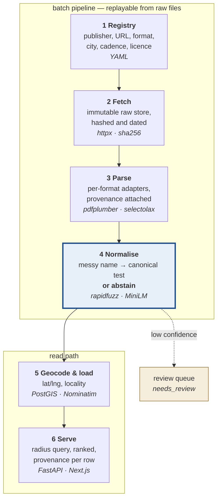
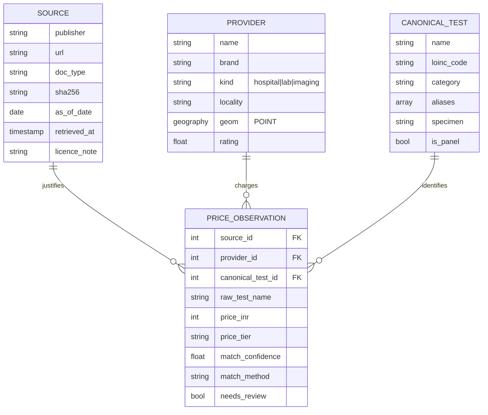

# Architecture

Six stages, one direction. Everything upstream of the database is a batch
pipeline replayable from immutable raw files; everything downstream is a
conventional read-heavy API.



**Stage 4 is the project.** Everything else is plumbing that exists to feed it.

## Why each stage looks like this

**1 Registry — declarative, not code.** Sources are data: publisher, URL,
format, city, refresh cadence, licence note. Adding a hospital should be a YAML
entry, not a new script.

**2 Fetch — never overwrite.** A new fetch is a new file, hashed and dated. A
changed sha256 means a changed document, not a silent mutation of the old one.
This is what makes "what did their rate card say in March?" answerable.

**3 Parse — OCR is a fallback.** The census assumed OCR would be the hard part.
It is not: the source PDFs carry digital text layers, so layout-aware table
extraction is the real requirement and OCR only runs on genuinely scanned
documents.

**4 Normalise — see [matching.md](matching.md).**

**5 Geocode & load — Postgres + PostGIS.** "Labs within 5 km of this point,
ordered by price" is one SQL query with a spatial index. Do not build that in
application code, and do not reach for MongoDB.

**6 Serve — FastAPI + Next.js.** Same language as the pipeline, so models and
validation are shared rather than duplicated. Server rendering because a price
page benefits from shareable URLs like `/bengaluru/cbc/indiranagar`.

## Data model

Four tables carry the whole product.



**The design rule: a price row can never exist without a source and a date.**
There are no orphan prices, by schema.

`needs_review` earns its column because it lets the matcher abstain instead of
guessing. A row the model is unsure about is held back from the public
comparison rather than shown wrong — and the size of that queue is a number you
can report honestly.

`raw_test_name` is kept alongside the resolved id forever. When the taxonomy
improves, every past observation can be re-matched without re-fetching anything.

## `price_tier` is not a shared enum

The two Narayana units in the corpus publish **different tier schemas**:

```
Bengaluru (11)  OPD │ General (C) │ Semi Private │ SEMI DELUXE │ Private │
                PLATINUM-B │ PLATINUM-A │ PLATINUM SUITE │ CCA │ HDU │ SDU
Guwahati   (8)  OPD │ General C │ General │ Semi Private │ Private │
                Deluxe │ CCA │ NICU
```

Column one is the OPD walk-in rate in both, and that is the tier the comparison
uses. But the tier vocabulary is **per-document**, so Stage 3 must carry the
source's own column header rather than normalise it away. Comparing a "Deluxe"
row against a "PLATINUM-A" row would produce a table that looks authoritative
and means nothing — which is worse than no comparison.

## Stack, and why

| Choice | Reason |
|---|---|
| **Python** for the pipeline | The PDF, fuzzy-matching and embedding libraries all live here and nowhere else |
| **Postgres + PostGIS** | The core query is spatial. One index, one SQL statement |
| **FastAPI** | Same language as the pipeline; shared models and validation |
| **Next.js** | Server rendering and shareable URLs for price pages |
| **Neon/Supabase + Railway + Vercel** | Usable free tiers, no card needed for a student project |

## Repository layout

```
src/ratecard/
  names.py            normalisation — shared by taxonomy and matcher so they cannot drift
  taxonomy/           210 canonical tests in data/*.yaml; loader validates hard
    schema.py         what a canonical test is, and which fields block a match
    loader.py         strict validation — alias collisions are a hard error
    coverage.py       measure the taxonomy against a corpus
  normalise/          STAGE 4
    rules.py          the veto: structural reasons two tests can never be one
    attributes.py     reads those same attributes out of free text
    matcher.py        the four layers
    rerank.py         optional embedding pass, lazily imported
  evaluate/           PHASE 03
    sampling.py       stratified draw + population sidecar
    labelling.py      interactive labeller, autosaving
    metrics.py        five outcomes, per-stratum, reweighted
scripts/
  phase00_seed_corpus.py   deliberately throwaway; Phase 04 replaces it
data/
  raw/ interim/ corpus/    gitignored, regenerable from the registry
  eval/                    COMMITTED — hand labels are irreplaceable
```

## What is built

Stages 1–3 exist only as the throwaway Phase 00 script. Stage 4 is real. Stages
5–6 are seams. See [CLAUDE.md](../CLAUDE.md) for current phase state.
