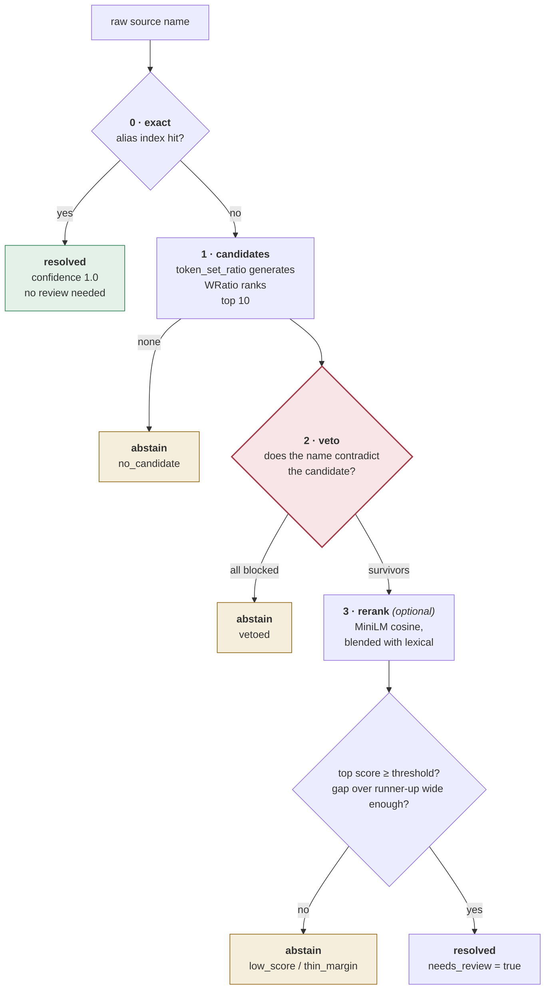
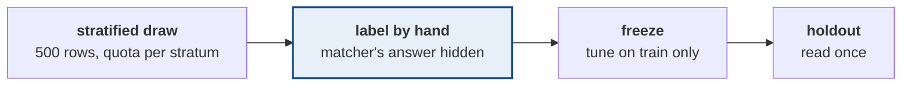

# How the matching works

Stage 4 is where the defensible technical work lives. This is the document to
read if you want to know what the ML in this project actually is.

## The problem

Across three sources the same test appears as `COMPLETE BLOOD COUNT (CBC)`,
`CBC`, `Complete Blood Count`, `haemogram`, and `CBP` — and separately as `RED
BLOOD CELL COUNT`, which is **not** the same test and is priced differently.

Until names resolve to a canonical entity, no two prices can be compared and the
product does not exist.

What makes it genuinely hard is that lexical similarity and clinical sameness
come apart in both directions:

| Pair | Looks | Is |
|---|---|---|
| `Vitamin D 25-Hydroxy` / `Vitamin D 1,25-Dihydroxy` | one token apart | different tests, ₹2,890 vs ₹2,800 |
| `Troponin I` / `Troponin T` | one character apart | different assays, different prices |
| `Lipid Profile` / `Lipid Profile Extended` | one word apart | 5 analytes vs 9, roughly double |
| `lactate dehydrogenase ldh` / `LDH` | barely overlapping | **the same test** |
| `CT` (Clotting Time) / `CT Brain` | share the abbreviation | a blood test and a scan |

A pure edit-distance matcher merges the first three and misses the fourth. So
scoring alone cannot be the answer.

## The four layers



### 0 · Exact

The alias index maps every normalised surface form to one canonical id. A hit
here is correct by construction and is the **only** result trusted without
review.

Normalisation is deliberately conservative: it lowercases, folds unicode,
normalises British/American spelling (`haemoglobin` → `hemoglobin`), strips
punctuation and leaked price fragments. It may remove noise that cannot
distinguish two tests — and nothing else.

> A stopword list must never eat a single letter. `"a"` was once a stopword,
> which turned `Vitamin A` into `vitamin` and made a bare `VITAMIN` row
> exact-match Vitamin A at confidence 1.0. Single letters are identity here:
> Vitamin A, Hepatitis A, Influenza A, Apo A1.

### 1 · Candidates — two scorers, on purpose

`token_set_ratio` **generates**. It is word-order invariant, which is what
closes the large class of misses like `lactate dehydrogenase ldh` → `LDH`.

`WRatio` **ranks**. The split exists because `token_set_ratio` returns a flat
**100 whenever one token set is a subset of the other** — so `blood urea
nitrogen bun` tied `urea` against `bun` at 100 apiece and abstained on a row it
should have resolved.

`token_sort_ratio` fixes that and then over-punishes elaboration, scoring `esr
automated westergren erythrocyte sedimentation rate` against `esr` at **10**.

Measured on a seven-case discrimination set — each a raw name with one right and
one plausibly wrong surface:

| scorer | ranked correctly |
|---|---|
| **WRatio** | **7/7** |
| token_sort_ratio | 6/7 |
| token_set_ratio | 4/7 |
| partial_token_sort_ratio | 3/7 |

Two structural guards sit here, and they are *not* tuned thresholds. A candidate
must share a word of 3+ characters with the query, and that word must not be
generic. `12 GENE PANEL (NGS)` was tying `iron_studies` against `lipid_profile`
because all three contain "panel".

### 2 · Veto — the layer that makes this more than string distance

The taxonomy declares structural facts about what each test *is*. Two tests
disagreeing on any of them can never be the same test, whatever they scored:

| Field | Blocks |
|---|---|
| `specimen` | serum calcium ≠ urine calcium; serum albumin ≠ urine microalbumin |
| `is_panel` | CBC ≠ RBC count — a panel is never one of its own members |
| `analytes` | lipid profile (5) ≠ lipid extended (9); thyroid ≠ free thyroid (same count, different set) |
| `modality` | ultrasound ≠ MRI |
| `views` | chest X-ray PA ≠ PA + lateral |
| `contrast` | plain CT ≠ contrast CT, roughly double the price |
| `kind` | Clotting Time ("CT") ≠ CT Brain |

**The bridge.** Those rules compare two canonical tests — but matching has a
*raw string* on one side. So `attributes.py` reads the same attributes out of
free text that the taxonomy declares as fields:

```
"CT BRAIN PLAIN"          → modality=ct, contrast=False   ⇒ vetoes ct_brain_contrast
"24 HRS URINE FOR CALCIUM"→ specimen=urine_24h            ⇒ vetoes calcium_serum
"FREE T3"                 → qualifier=free                ⇒ vetoes t3_total
"X RAY CHEST PA AND LAT"  → modality=radiography, views=2 ⇒ vetoes xray_chest_pa
```

Every attribute is a **hint**. Absent means *unknown*, never *false*, and two
attributes conflict only when both sides assert something. Guessing in either
direction would put the veto layer to work rejecting correct matches, which is
worse than the confusion it prevents.

"CT" is only read as a scan next to a region word — because in Indian rate cards
it abbreviates Clotting Time at least as often.

**Curated pairs.** Some confusions no structural field separates: Troponin I vs
T, Widal vs Typhidot, urea vs BUN. The taxonomy declares those explicitly
(`distinct_from`, 31 pairs), and a close curated pair is resolved by **evidence**
— a word in the raw name belonging to one of the pair and not the other:

- `blood urea nitrogen bun` carries "bun", which appears in `bun`'s surfaces and
  nowhere in `urea`'s → **resolves**
- a bare `TROPONIN` carries nothing separating I from T → **abstains**

Every declaration is automatically a seed for the hard-negative evaluation set,
so writing one is also writing a test case.

### 3 · Rerank — optional, and it subtracts

A sentence-transformer (`all-MiniLM-L6-v2`) scores the raw name against each
surviving candidate's canonical name. It is **off by default** and isolated
behind a two-method interface, because it is the only part of the project that
wants PyTorch.

It **blends** with the lexical score rather than replacing it. Substituting it
collapsed the spread between candidates — MiniLM cosines on short medical
phrases rarely leave 0.5–0.95 — so nearly everything fell into the thin-margin
window and rows that had been resolving correctly regressed to abstentions.

What it actually does, measured over a 1,500-name random sample:

```
resolved what lexical refused :  11
refused what lexical resolved : 204
picked a different test       :   0
```

It is a **precision filter, not a recall booster**. Twelve of those refusals were
inspected by hand and all twelve were lexical errors — `CT ELBOW RIGHT` →
`clotting_time`, `OT CHARGES - PER 15 MINS` → `ca_15_3`, `LUMBAR DRAIN` →
`xray_lumbar_spine`, `FACTOR VII ASSAY` → `rheumatoid_factor`.

Twelve of 204 is not a measurement, and some of the other 192 are certainly
correct matches being lost. But it is enough to say the lexical layer is
confidently wrong often enough that the headline resolution figure overstates
it. Phase 03 turns this into numbers.

## Abstention is a feature

The matcher refuses when the top score is low, when the top two are too close,
or when every candidate is vetoed. For this product:

> **"94% precision at 71% coverage, abstains on the rest" beats "88% at 100%."**

Showing nothing is a disappointment. Showing a confident price for the wrong
test destroys the one thing the product sells. Refused rows land in the review
queue via `needs_review`, and the size of that queue is a number you can report
honestly.

## Current state — untuned

Over the 13,112-row corpus:

```
ROWS     2716/13112   20.7% resolved
NAMES    2298/11755   19.5% resolved
canonical tests observed   205/210 (98%)

  abstain_no_candidate  58.7%    lexical              17.3%
  abstain_thin_margin   14.5%    abstain_low_score     6.0%
  exact                  2.3%    abstain_vetoed        1.3%
```

**20.7% resolved is not 20.7% correct**, and the high abstention rate is
expected: the corpus is a whole hospital catalogue — surgeries, chemotherapy,
bed charges — and ~59% of names genuinely have no answer in a 210-test routine
taxonomy. Silence is correct for those.

**Every threshold is an untuned placeholder.** That is deliberate and load-bearing.

## Evaluation — the part that makes it real



**Stratified, not uniform.** A uniform draw would be ~59% surgical procedures
where the answer is "none". Each stratum gets a quota chosen for what it can
teach — 140 lexical matches because that is where confident errors live, 140
across the two hard strata because those are the veto layer's home ground. The
consequence is stated wherever numbers are: **sample rates are not corpus
rates**, and `corpus_estimate` reweights by true stratum sizes.

**The matcher's answer is hidden from the labeller.** The candidate pool is
shown — 210 options is more than anyone can hold in their head — but not which
one won, nor its score, and the list is sorted by id rather than by rank. A
labeller shown "the machine thinks this is `cbc`, agree?" agrees far more often
than they should.

**Label before tuning.** Fitting thresholds to the corpus first and labelling
second produces numbers that mean nothing.

**Five outcomes, not accuracy:** `correct_match`, `wrong_match`, `missed`,
`correct_abstention`, `unsure`. A missed row shows the user nothing; a wrong row
shows a confident price for the wrong test. They are not equally bad, so
precision leads and coverage is stated beside it.

**Hard-negative accuracy is reported separately.** "91% overall, 74% on the
confusable tail, and here is why the tail fails" is a substantially stronger
claim than any accuracy figure quoted without a breakdown.

## Where it goes next

1. Label the 500 rows (blocking, human, ~4–6 hours)
2. Tune thresholds on the train split — and settle whether the rerank earns its place
3. Read the holdout **once**
4. Write the failure analysis on the worst twenty

After that the project is defensible whether or not an app is ever built.
