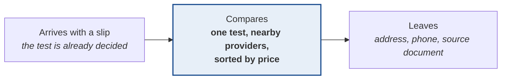

# What this app does

## The person it is for

Someone walks out of a clinic holding a slip that says *CBC and lipid profile*.
They have two days before the follow-up appointment. They do not know that the
same lipid profile costs ₹2,110 at one place and ₹449 at another a few
kilometres away, because there is nowhere to look it up.

That person is real, common, and currently unserved. Everything in this project
points at them.

## The one-line claim

**It fixes price opacity.** Not "improves healthcare access in India" — the app
does not create hospitals or add capacity, and that larger claim collapses under
one follow-up question. People overpay because they had no way to know what
things cost. That is smaller, true, and much harder to argue with.

## The session it serves

Three steps, short and directed. The landing screen is a **search field, not an
infinite feed**. Nobody browses diagnostics for pleasure; the test was chosen by
a doctor before the user ever opened the app.

## Zomato is half a useful analogy

Take the UX. Do not take the business model.

| | Zomato | This |
|---|---|---|
| Who supplies the data | Restaurants upload menus — being listed is a sales channel | Nobody uploads anything |
| Incentive | Aligned: they want to be found | **Opposed**: a lab charging ₹2,110 does not want to appear beside one charging ₹450 |
| What the data is | Authoritative — the restaurant said so | **Observed** — "this is what their published rate card said in March" |
| Revenue | Commission per order | None. You cannot take a cut of a blood test without hospital integration |

That single asymmetry explains the entire architecture. You are building
*against* the supply side rather than with it, which is why stages 1–4 are an
extraction pipeline and not a signup form — and why provenance and `as_of_date`
are load-bearing rather than polish.

**Worth taking from Zomato:** the card row that puts price, distance and rating
in one glance; sort and filter as first-class controls; savings framing ("₹1,660
less than the most expensive nearby"); and rating as a counterweight, because
ranking on price alone pushes people toward the worst lab in the area.

## What it is not

**Not an emergency tool.** In an emergency nobody price-compares — they go to
the nearest hospital or call an ambulance, and Google Maps already answers
"nearest hospital" better than this ever will. Serving both crisis routing and
price comparison would do neither well. The app's only emergency path is a
button that dials 108 / 112 and opens a map; it never asks anyone to register
or book first.

**Not a price predictor.** Cut deliberately. Training one needs the dense price
data whose absence motivated it, and a predicted number displayed inside a
price-comparison result destroys the one thing the product sells: trust in the
figure.

**Not a booking platform for providers who have not signed up.** Booking a
hospital that is not taking part would be a fake button on a project whose
entire value proposition is not lying about numbers. So booking exists only for
**partner providers** — ones who sign up and run a staff dashboard where they
publish doctor timings, today's OPD status and bookable slots.

This is where the Zomato analogy starts to work again. A price comparison is
built *against* the supply side; booking is built *with* it, because a clinic
wants its slots filled the way a restaurant wants orders. The two halves stay
separate:

| | Price comparison | Booking, live status, queue |
|---|---|---|
| Who it covers | Every provider with a public, displayable rate card | Partner providers only |
| Where data comes from | Extracted from published documents | Entered by the provider's own staff |
| Everyone else sees | — | Phone number and directions, never a Book button |

Patients register **once** and that one profile is reused at every partner, so
nobody fills in the same form at a second counter.

The current build is a portfolio demo. Its partner providers are **fictional,
seeded, and badged "Demo"** everywhere they appear. They are never named after a
real hospital. Real prices shown next to them stay real and sourced.

## The rule everything else follows

> A price row can never exist without a source and a date.

Every number shown links back to the document it came from, with a visible
last-verified date. A partner's own price list is a source too — "submitted by
the provider on this date" — so the rule holds for them as well. When the matcher is not confident which test a row refers
to, it **abstains** and the row is held back from public view rather than shown
wrong.

That is why the headline metric is precision at a stated coverage, not accuracy.
Showing nothing is a disappointment. Showing a confident price for the wrong
test is the failure this project exists to prevent.
