# RateCard prototype

A clickable demo of diagnostic test price comparison in Bengaluru. Someone
holding a doctor's slip that says "Lipid profile" searches for it, sees what
every lab nearby charges, and books at one of them. They can also find a
consultant by specialty, compare what each hospital charges for a
consultation, and book an appointment. The look follows a mint-and-teal
doctor-booking app design ([credit below](#design-notes)).

| Part | Built with | Folder |
|---|---|---|
| API | FastAPI, reading mock JSON | [`backend/`](backend) |
| Patient app | Flutter, Material 3 | [`mobile/`](mobile) |
| Admin dashboard | Vue 3 and Vite | [`admin/`](admin) |

> [!IMPORTANT]
> **Every hospital, doctor and price in this prototype is made up.** The ten
> hospitals are fictional (each is named after one of Bengaluru's street
> trees), and so are their doctors, who appear with initials rather than
> photos. All of them carry a **Demo** badge wherever they appear. Sign-in and
> bookings are mocked, so nobody is texted or contacted.

This folder stands alone. It doesn't use the price pipeline in the rest of this
repository, and it doesn't change the main app's architecture (Supabase and
Next.js, see the [main README](../README.md)).

## Screenshots

**Mobile app** (the Flutter web build at phone size)

<table>
  <tr>
    <td align="center" width="33%">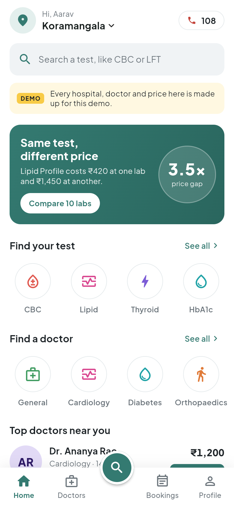<br><sub>Home: search first, then shortcuts</sub></td>
    <td align="center" width="33%">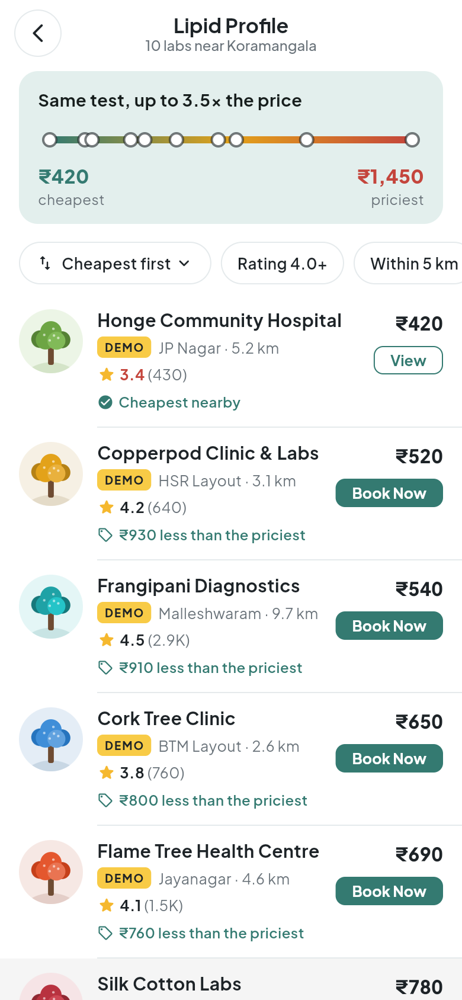<br><sub>Results: every lab's price on one strip</sub></td>
    <td align="center" width="33%">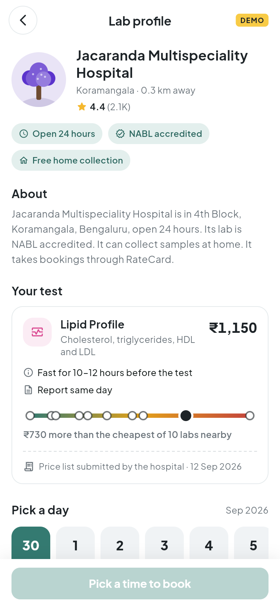<br><sub>Lab profile: the price, its source and date</sub></td>
  </tr>
  <tr>
    <td align="center">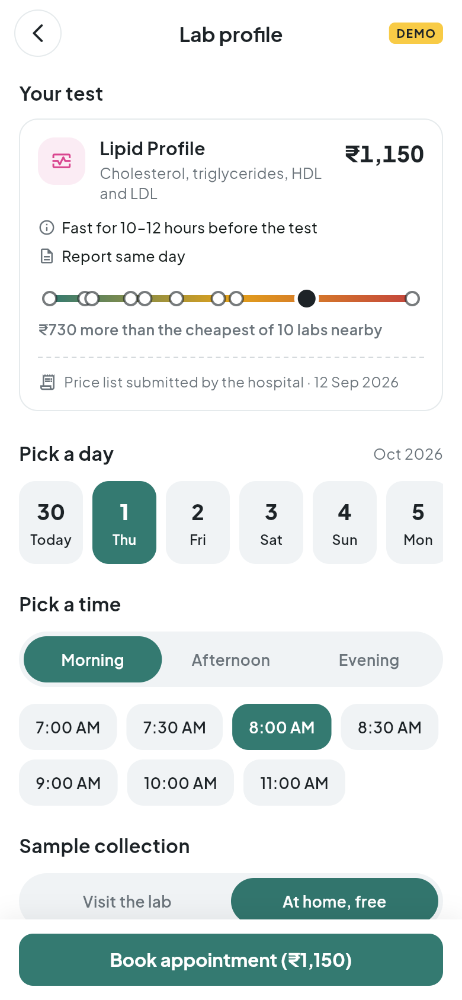<br><sub>Book: day, time, lab or home</sub></td>
    <td align="center">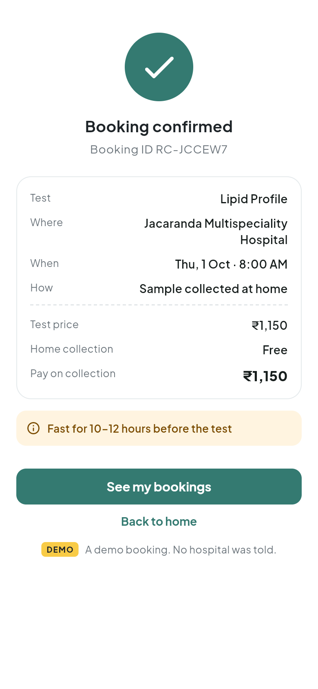<br><sub>Confirmed (mock)</sub></td>
    <td align="center">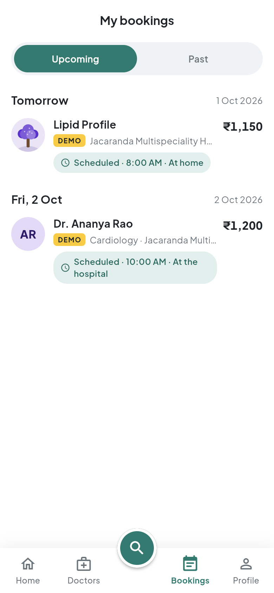<br><sub>My bookings: tests and doctors</sub></td>
  </tr>
  <tr>
    <td align="center">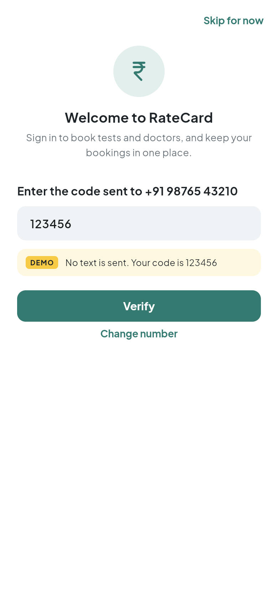<br><sub>Sign in: the demo shows the code</sub></td>
    <td align="center">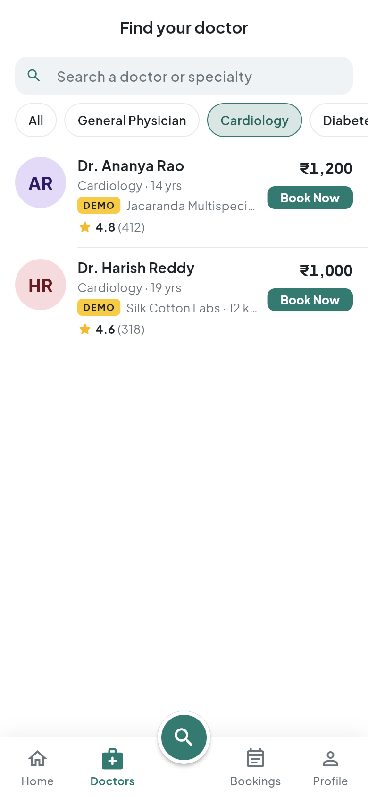<br><sub>Doctors by specialty, with fees</sub></td>
    <td align="center">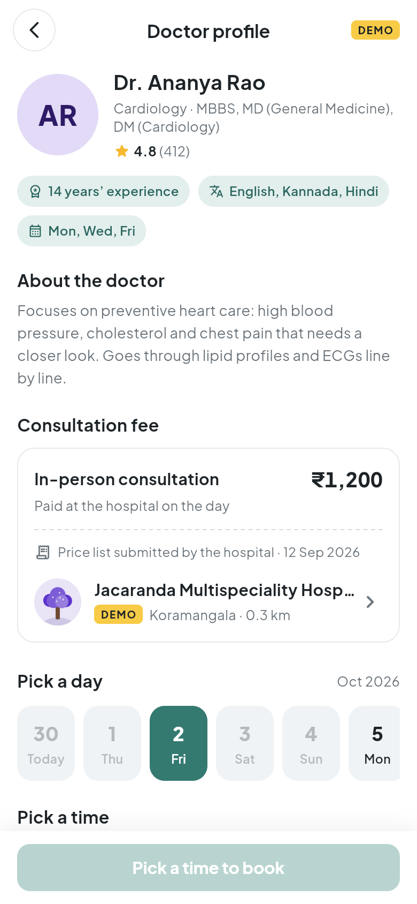<br><sub>Doctor profile: fee, source and date</sub></td>
  </tr>
</table>

**Admin dashboard: every price, editable in place**

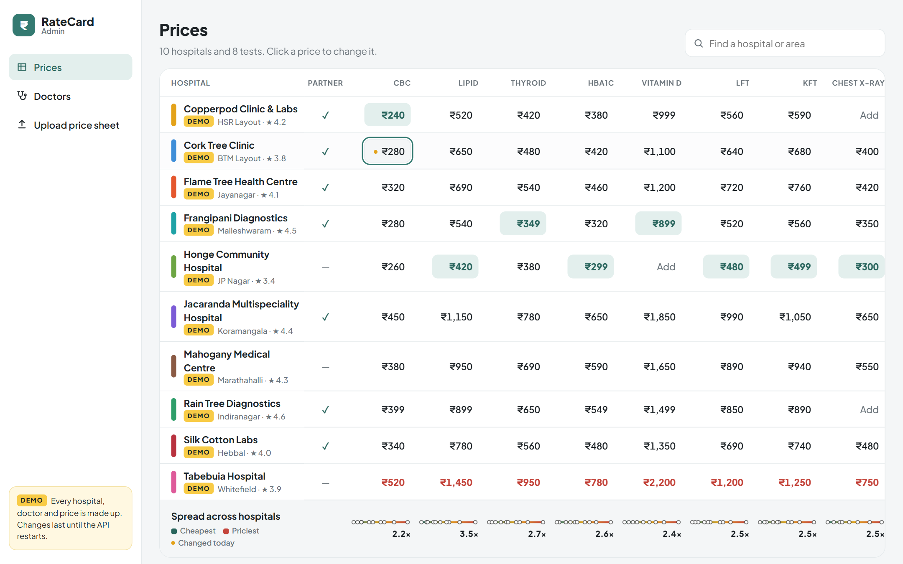

**Admin dashboard: every doctor, with their consultation fee editable in place**

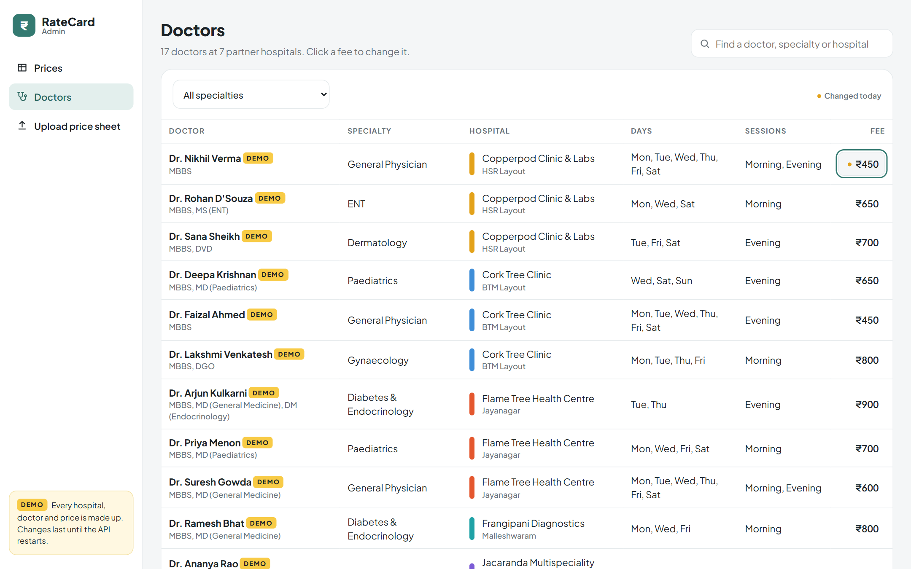

**Admin dashboard: upload a price sheet and check the matches**

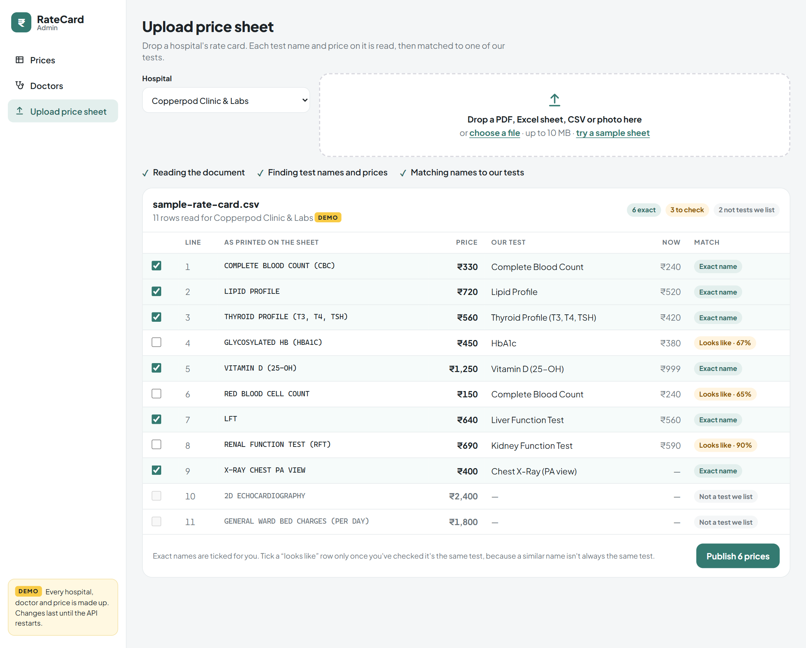

**API docs** at `http://localhost:8000/docs`

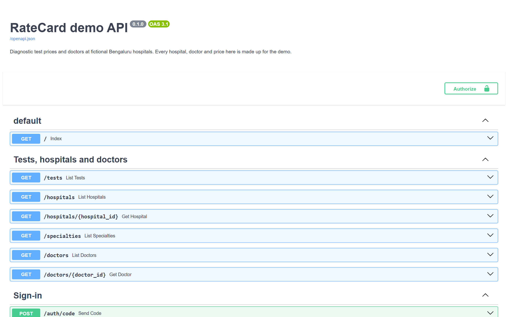

## Run it

You need **Python 3.11+**, **Node.js 20.19+** and **Flutter 3.47+**. Start the
API first; the app and the dashboard both read from it.

### 1. API (port 8000)

```bash
cd prototype/backend
python -m venv .venv
# Windows:        .venv\Scripts\activate
# macOS / Linux:  source .venv/bin/activate
pip install -r requirements.txt
uvicorn main:app --reload
```

Open <http://localhost:8000/docs> to try every endpoint in the browser.

### 2. Admin dashboard (port 5173)

```bash
cd prototype/admin
npm install
npm run dev
```

Open <http://localhost:5173>.

### 3. Mobile app

```bash
cd prototype/mobile
flutter pub get
flutter run -d chrome    # quickest: runs in the browser at phone size
flutter run              # or on an Android emulator / iOS simulator
```

The app finds the API on its own: `localhost:8000`, or `10.0.2.2:8000` from
the Android emulator. For a **real phone** on your Wi-Fi, start the API with
`uvicorn main:app --host 0.0.0.0`, then run
`flutter run --dart-define=API_URL=http://<your-computer's-IP>:8000`.

If `flutter run` complains, run `flutter doctor`. For Android it wants the
Android SDK 36 platform and accepted licences (`flutter doctor --android-licenses`).

## Things to try

1. **Sign in, or skip.** A fresh start opens on sign-in. Enter any Indian
   mobile number (98765 43210 works). No text is sent: the app shows the
   code, which is always 123456. "Skip for now" lets you look around; the app
   asks you to sign in when you book.
2. **Tap the round search button and type "haemogram".** It finds Complete
   Blood Count, because each test is searchable by the other names labs print
   for it.
3. **Open Lipid Profile.** The strip at the top puts every lab's price on one
   line: ₹420 to ₹1,450, up to 3.5× for the same test.
4. **Look at the cheapest lab's rating (3.4, in coral), then tap "Rating
   4.0+".** It drops out. Price alone can send you to the worst lab nearby, so
   rating sits next to it on every row.
5. **Change your area** (tap Koramangala at the top) and distances follow.
6. **Book a partner lab.** Its profile has a day strip, Morning, Afternoon and
   Evening slots, and lab visit or home collection. Labs with a "View" button
   instead of "Book Now" aren't partners: they show prices only, and the API
   refuses to book them.
7. **Find a doctor.** Open the Doctors tab and tap Cardiology. The same
   consultation costs ₹1,000 at Silk Cotton Labs and ₹1,200 at Jacaranda. A
   doctor's page offers only the days and sessions they see patients; the
   other days are greyed out.
8. **Open the Bookings tab** after booking. Tests and doctors' appointments
   are grouped by day. Pull down on any list to refresh it.
9. **Change a price or a doctor's fee in the admin**, then reopen it in the
   app. It now says "Edited in the admin dashboard", with today's date.
10. **Upload a price sheet** ("try a sample sheet" works without a file). Six
    names match a known name exactly and are ticked for you. **RED BLOOD CELL
    COUNT** "looks like" Complete Blood Count at 65%, but it's a different
    test. That's why only exact matches are ticked automatically.

## What's real and what's mocked

| Part | Real or mocked |
|---|---|
| **Data** | [`backend/mock_data.json`](backend/mock_data.json): 10 hospitals, 8 tests and their prices, and 17 doctors in 9 specialties at the 7 partner hospitals. Loaded into memory at start-up. Edits, sign-ins and bookings last until the API restarts. |
| **Distances** | Real: straight-line (haversine) from the area you pick to each hospital. Hospital locations are rough neighbourhood centres. |
| **Sign-in** | Mocked: no text message is sent, and the code is always `123456` (the app shows it). The first sign-in with a number creates the account. The app remembers you between visits, but the API forgets every account when it restarts, so then you're asked to sign in again. |
| **Bookings** | Mocked: stored in memory, nobody is notified, and slots never fill up. The API does check the rules: partner hospitals only, a time that hasn't passed within the next two weeks, a doctor's own days and hours, and home collection only where offered. |
| **Price-sheet reading** | Mocked: any PDF, Excel, CSV or image returns the same 11 rows. |
| **Name matching** | Real: an exact known name is a match. A name that's merely similar (Python's `difflib`, 60% or more) is a suggestion a person must confirm. Anything else is "not a test we list". |

## API

| Method | Path | What it does |
|---|---|---|
| `GET` | `/tests` | Every test, with how many labs offer it and its lowest and highest price |
| `GET` | `/hospitals?test_id=cbc&lat=&lng=` | Labs offering a test, cheapest first, with distance from `lat`/`lng` (defaults to Koramangala). Without `test_id`: every hospital |
| `GET` | `/hospitals/{id}` | One hospital with all its prices |
| `GET` | `/specialties` | Every specialty, with how many doctors practise it and their fee range |
| `GET` | `/doctors?specialty=cardiology&hospital_id=` | Doctors at partner hospitals, nearest first. Both filters are optional |
| `GET` | `/doctors/{id}` | One doctor: about, qualifications, consultation fee, days and time slots, and their hospital |
| `POST` | `/auth/code` | Start signing in with a mobile number. Nothing is texted: the demo returns the code, which is always `123456` |
| `POST` | `/auth/verify` | Number and code in, sign-in token out. The first sign-in creates the account |
| `GET`, `PUT` | `/me` | Who's signed in, or set your name. **Signed in** |
| `POST` | `/auth/sign-out` | Forget this sign-in token |
| `POST` | `/bookings` | Book a test or a doctor at a partner hospital. **Signed in** |
| `GET` | `/bookings` | Your bookings, soonest first. **Signed in** |
| `PATCH` | `/hospitals/{id}/prices` | Admin: set prices, e.g. `{"prices": {"cbc": 299}}`. Each records its source and today's date |
| `PATCH` | `/doctors/{id}/fee` | Admin: set a doctor's consultation fee, e.g. `{"fee": 800}`, recorded the same way |
| `POST` | `/price-sheets/extract` | Admin: upload a rate card (form fields `hospital_id`, `file`) and get its rows matched to tests |

**Signed in** means sending `Authorization: Bearer <token>`, with the token from
`/auth/verify`. The admin endpoints need no sign-in, which is fine for a demo
on your own computer and nowhere else.

Every price and consultation fee comes back as
`{"amount": 450, "source": "...", "as_of": "2026-09-12"}`, and the app shows
the source and date under each one.

## How the code is laid out

```
prototype/
├── backend/
│   ├── main.py            the app: CORS and the four routers below
│   ├── catalog.py         tests, hospitals, specialties and doctors (what the app reads)
│   ├── auth.py            sign-in with a mobile number and a one-time code
│   ├── bookings.py        booking a test or a doctor, and the rules for both
│   ├── admin.py           price and fee edits, price-sheet upload and name matching
│   ├── store.py           the in-memory data and the helpers they share
│   ├── mock_data.json     the fictional hospitals, tests, doctors and prices
│   └── test_*.py          API tests (pytest), one file per router
├── mobile/lib/
│   ├── main.dart          app entry and routes (each page has a URL on web)
│   ├── session.dart       who's signed in, remembered between visits
│   ├── api.dart           HTTP calls to the backend, signed in where it matters
│   ├── models.dart        Test, Hospital, Price, Specialty, Doctor, Booking
│   ├── booking_draft.dart which days and slots are still open (unit tested)
│   ├── filters.dart       sort orders and filter chips
│   ├── theme.dart         colours, type and component styles
│   ├── screens/           tabs (home, doctors, bookings, profile), sign-in, search,
│   │                      tests, labs, results, lab and doctor profiles, confirmation
│   └── widgets/           pressable.dart (the press animation), async_view.dart
│                          (loading, error and retry for every screen), booking
│                          panel, lab, doctor and test rows, initials, tree pictures…
├── admin/src/
│   ├── views/PricesView.vue   the editable price table
│   ├── views/DoctorsView.vue  every doctor, with their consultation fee editable in place
│   ├── views/UploadView.vue   upload, review and publish a price sheet
│   ├── components/            AmountCell (click, type, Enter to save: both tables use it),
│   │                          AsyncContent (loading and retry), SearchBox, PriceSpread
│   ├── toast.js               the one toast every page reports to
│   └── api.js                 HTTP calls to the backend
└── screenshots/
```

## Tests

```bash
cd prototype/backend && pip install -r requirements-dev.txt && pytest   # 80 API tests
cd prototype/mobile && flutter test         # 22 tests: slots, sign-in, press animation, formatting
cd prototype/mobile && flutter analyze      # strict lints, see analysis_options.yaml
```

## Design notes

- **Visual reference:** the app's look is adapted from the "Doctor
  Consultation Mobile App Design" shot by Mahmudul Hasan
  ([dribbble.com/mhmanik02](https://dribbble.com/mhmanik02)). Adapted from it:
  the teal-and-mint palette, the header and banner, round category tiles,
  compact rows with a Book Now button, the profile page with a day strip,
  Morning / Afternoon / Evening tabs and a full-width booking button, the
  appointments list, and a tab bar with a raised centre button. No images
  from the design are used.
- **Press feedback:** every button, chip, tab and tile shrinks a little while
  it's held and springs back when released, alongside the usual ripple. It's
  switched off when the phone is set to reduce motion.
- **Accessible contrast:** the design's teal (#3C887E) is deepened slightly
  (#347A71) so white text on it meets the WCAG AA contrast ratio of 4.5:1.
- **Kept from the product idea:** Home leads with search, because people
  arrive knowing which test their doctor wrote down. Every price and
  consultation fee shows its source and date on its own page, where you book
  it. Savings are said in rupees ("₹930 less than the priciest"), and rating
  sits next to price.
- **No stock photos.** Where the design has photos, each lab has its tree
  drawn in code, in that tree's colour (jacaranda purple, tabebuia pink,
  copperpod yellow), and each doctor has their initials. The doctors are as
  fictional as the hospitals.
- **Emergencies:** the app is for planned tests. Its only emergency feature is
  the 108 button, which opens the phone's dialler.
- **Type:** Plus Jakarta Sans, bundled with the app under the SIL Open Font
  Licence ([`mobile/assets/fonts/OFL.txt`](mobile/assets/fonts/OFL.txt)).
